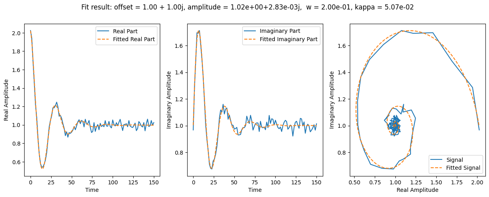
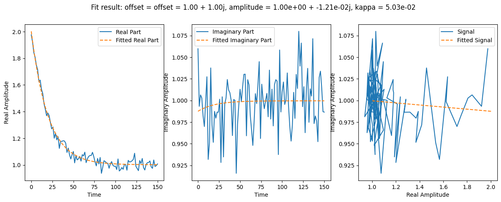
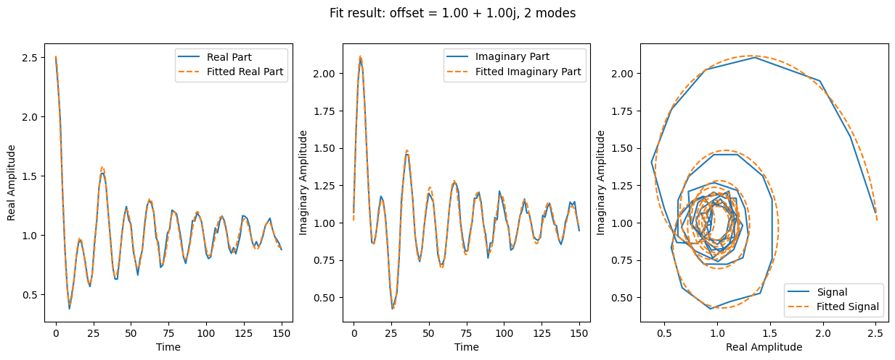

# bicfit

bicfit is a lightweight Python library for fitting damped cosine and exponential functions.
It combines the Generalized Pencil-of-Function method [^1] (to generate robust initial guesses) with standard optimization routines (to refine the fit).

This makes it well-suited for researchers and practitioners dealing with decaying oscillations, resonance signals, or exponential relaxations in noisy data. 

Currently, bicfit supports fitting:
- Complex exponential decay $f(t) = x_0 + \sum_k A_k \exp((j\omega_k - \kappa_k) t)$
- Damped cosine $f(t) = x_0 + \sum_k A_k \exp(-\kappa_k t) \cos(\omega_k t + \phi_k)$
- Exponential decay $f(t) = x_0 + \sum_k A_k \exp(-\kappa_k t)$
 
[^1]: _Generalized Pencil-of-Function Method for Extracting Poles
of an EM System from Its Transient Response_ Hua and Sarkar (IEEE TRANSACTIONS ON ANTENNAS
AND PROPAGATION, VOL. 37, NO. 2, FEBRUARY 1989) 

## Usage

Start with 
```python 
import numpy as np

w = 0.2
kappa = 0.05
offset = 1 + 1j
sigma_noise = 0.03
n_points = 100
```

### Complex exponential decay
```python
from bicfit import fit_complex_exponential

times = np.linspace(0, 150, n_points)
noise = np.random.normal(0, sigma_noise, n_points) + 1j * np.random.normal(0, sigma_noise, n_points)
signal = offset + np.exp((1j * w - kappa) * times) + noise

result = fit_complex_exponential(times, signal)
result.plot()
result
```



In this example, `result` is an object of type `ComplexResult` that has the following attributes:
- `offset`: the offset of the data
- `amplitudes`: the amplitudes of the modes
- `pulsations`: the pulsations of the modes
- `decay_rates`: the decay rates of the modes
- `times`: the times of the data
- `signal`: the original signal
- `frequencies`: (read-only) the frequencies of the modes, computed as `pulsations / (2 * np.pi)`

As a convenience, the `result` object also has a `plot()` method that plots the original signal and the fitted function. 
It also exposes a `modes` property that returns a list of `Mode` objects, each containing the amplitude pulsation and decay rate of the mode.

The `ComplexResult` and `ComplexMode` classes (as all `Result` and `Mode` classes) are callable so you can use them to 
evaluate the fitted function at any time.

### Damped cosine
```python
from bicfit import fit_damped_cosine

signal = signal.real

result = fit_damped_cosine(times, signal)
result.plot()
result
```


Here the `result` is an object of type `DampedCosineResult` that has similar attributes to the `ComplexResult` class:
- `offset`: the offset of the data
- `amplitudes`: the amplitudes of the modes
- `phases`: the phases of the modes
- `pulsations`: the pulsations of the modes
- `decay_rates`: the decay rates of the modes
- `times`: the times of the data
- `signal`: the original signal
- `frequencies`: (read-only) the frequencies of the modes, computed as `pulsations / (2 * np.pi)`

The `DampedCosineResult` object also has a `plot()` method that plots the original signal and the fitted function.
It exposes a `modes` property that returns a list of `DampedCosineMode` objects, each containing the amplitude, pulsation, decay rate, and phase of the mode.

### Exponential decay

```python
from bicfit import fit_exponential_decay

noise = np.random.normal(0, sigma_noise, n_points) + 1j * np.random.normal(0, sigma_noise, n_points)
signal = offset + np.exp(- kappa * times) + noise

result = fit_exponential_decay(times, signal, is_complex=True)
result.plot()
result
```



⚠️ Fitting an exponential can be tricky in general. If you do not have data long enough that the exponential plateaus, the fit will not work well.
If you know where the exponential plateaus, you do not need as much data but bicfit does not exploit this knowledge yet.

### Multiple modes

```python
a1, a2 = 1.0, 0.5
w1, w2 = 0.2, 0.4
kappa1, kappa2 = 0.05, 0.01

noise = np.random.normal(0, sigma_noise, n_points) + 1j * np.random.normal(0, sigma_noise, n_points)
signal = offset + a1 * np.exp((1j * w1 - kappa1) * times) + a2 * np.exp((1j * w2 - kappa2) * times) + noise

result = fit_complex_exponential(times, signal, n_modes=2, with_post_fit=True)
result.plot()
result
```


Here the `result` is an object of type `ExponentialDecayResult`that has similar attributes to the `ComplexResult` class:
- `offset`: the offset of the data
- `amplitudes`: the amplitudes of the modes
- `pulsations`: the decay rates of the modes
- `times`: the times of the data
- `signal`: the original signal

It also has the `plot()` function, `modes` attribute and is callable like the other result classes.

## Coming features

There are a few features that are not implemented yet but could be in the future, if there is a demand for them:
- [ ] exploiting knowledge of the plateau of an exponential decay
- [ ] fitting non uniformly sampled data
- [ ] port fit functions to JAX
- [ ] [performance] amplitude fitting is probably overkill and could be done from the pencil eigenvalues 

## Feedback

We welcome any feedback, suggestions, or bug reports to help improve bicfit.

If you find a case where the fit fails, please include your data in CSV format for reproducibility.
